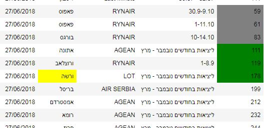
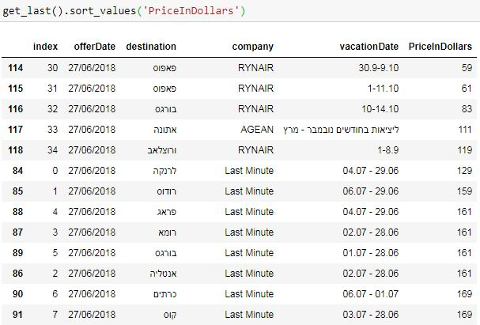
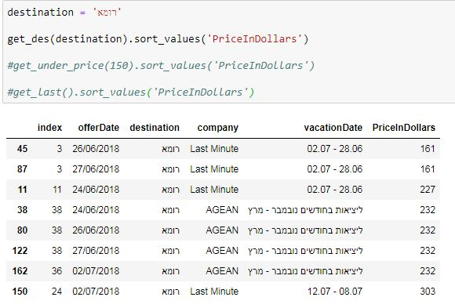

# Flights

Get cheap flights prices bot.

F-Scraper.py - python file runs daily on my computer automatically (windows task scheduler) and inserts data to
DB. 

flights3.0.ipynb - notebook where you can access the data and look for info

printlog.py - add to the end of F-Scraper to write automatic run log 

## sources :

## highlight selected prices and destinations 

  

## see last offers ordered by price 

  

## see destination price history  

  

# part A 
## get flight prices from site :

last minute flights : https://www.gulliver.co.il/Content/SalePage.aspx?pageId=99&module=Flights

sale prices HAMEZION : https://www.gulliver.co.il/Content/SalePage.aspx?pageId=264&module=Flights

load into dataframe 

done by beautiful soup , pandas 

---------
# part B 

from dataframe insert to db file 

done using sqlite3

# part C 
## TO DO
upload to web - heroku or aws
(change to postgresql if needed)

ML predictions

